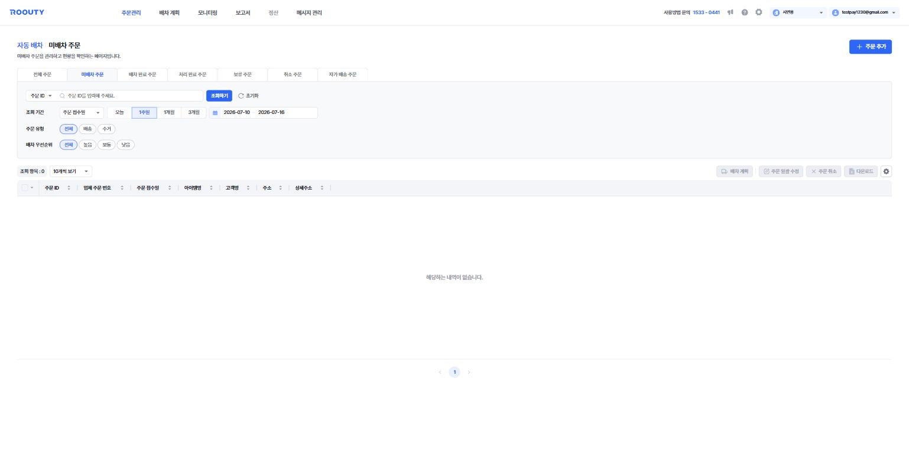
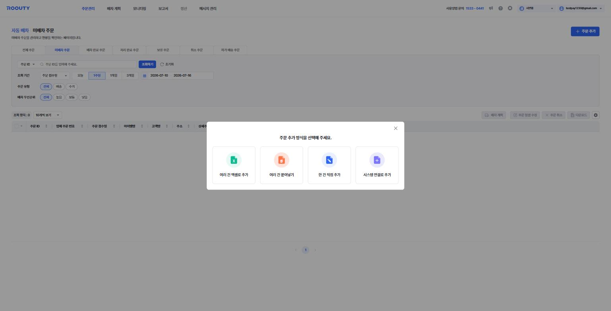
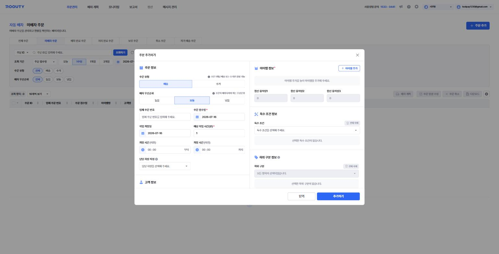

# 주문관리

**배송/수거 주문을 등록하고 상태별로 관리하는 메뉴**입니다. 루티 업무의 시작점으로, 여기서 등록한 주문이 배차 계획의 대상이 됩니다.

*주문관리 > 자동 배차 > 미배차 주문 화면. 상단에 주문 상태 탭, 가운데 검색 필터, 아래 주문 목록이 있습니다.*

> 기준 화면: `tms.roouty.io/manage/order/auto/*`

## 주문 상태 탭

화면 상단의 탭으로, 주문이 어느 단계에 있는지에 따라 나뉘어 보입니다.

| 구분 | 용어 | English | 정의 |
|---|---|---|---|
| 탭 | 전체 주문 | All Orders | 상태와 무관한 모든 주문 |
| 탭 | 미배차 주문 | Unassigned Orders | 아직 차량에 배정되지 않은 주문 |
| 탭 | 배차 완료 주문 | Assigned Orders | 차량 배정이 완료된 주문 |
| 탭 | 처리 완료 주문 | Completed Orders | 배송/수거 작업까지 완료된 주문 |
| 탭 | 보류 주문 | On-hold Orders | 처리 대기 상태로 보류된 주문 |
| 탭 | 취소 주문 | Cancelled Orders | 취소 처리된 주문 |
| 탭 | 자가 배송 주문 | Self-delivery Orders | 자가 배송으로 처리되는 주문 |

## 조회 · 필터

| 구분 | 용어 | English | 정의 |
|---|---|---|---|
| 필터 | 검색 기준 | Search Key | 주문 검색 기준 — 주문 ID, 업체 주문 번호, 담당 차량 지정, 아이템명, 고객명, 주소, 특수 조건, 비고1~5 중 선택 |
| 필터 | 조회 기간 기준 | Period Type | 조회 기간의 기준 날짜 — 주문 접수일 또는 작업 희망일 |
| 필터 | 주문 유형 | Order Type | 전체 / 배송 / 수거 |
| 필터 | 배차 우선순위 | Dispatch Priority | 전체 / 높음 / 보통 / 낮음 |

## 버튼 (주문 목록 기능)

| 구분 | 용어 | English | 정의 |
|---|---|---|---|
| 버튼 | 주문 추가 | Add Order | 신규 주문 등록 — 아래 4가지 방식 중 선택 |
| 버튼 | 배차 계획 | Create Dispatch Plan | 선택(체크)한 미배차 주문으로 배차 계획을 생성 |
| 버튼 | 주문 일괄 수정 | Bulk Edit Orders | 선택한 여러 주문의 정보를 한 번에 수정 |
| 버튼 | 주문 취소 | Cancel Order | 선택한 주문을 취소 처리 |
| 버튼 | 다운로드 | Download | 조회된 주문 목록을 파일로 내려받기 |

## 주문 추가 방식

`+ 주문 추가` 버튼을 누르면 4가지 등록 방식을 선택할 수 있습니다.

*주문 추가 방식 선택 팝업*

| 구분 | 용어 | English | 정의 |
|---|---|---|---|
| 버튼 | 여러 건 엑셀로 추가 | Bulk Add via Excel | [주문등록 양식](../forms/order-upload-form.md)(엑셀) 업로드로 여러 주문을 한 번에 등록 |
| 버튼 | 여러 건 붙여넣기 | Bulk Add via Paste | 데이터를 복사·붙여넣기하여 여러 주문을 한 번에 등록 |
| 버튼 | 한 건 직접 추가 | Add Single Order | 입력 폼에서 주문 1건을 직접 등록 |
| 버튼 | 시스템 연결로 추가 | Add via System Integration | 외부 시스템 연동(API 등)으로 주문을 자동 등록 |

## 주문 정보 필드

`한 건 직접 추가` 폼 기준입니다. 엑셀 양식의 영문 Key는 [주문등록 양식](../forms/order-upload-form.md)을 참고하세요.

*주문 추가하기 폼 — 주문 정보 · 고객 정보 · 아이템 정보 · 특수 조건 · 하위 구분 순으로 입력합니다. `*` 표시는 필수 입력입니다.*

| 구분 | 용어 | English | 정의 |
|---|---|---|---|
| 필드 | 주문 ID | Order ID | 시스템이 부여하는 주문 고유 식별자 |
| 필드 | 업체 주문 번호 | Client Order Number | 당사에서 사용 중인 자체 주문 번호 |
| 필드 | 주문 상태 | Order Status | 주문의 현재 처리 단계 |
| 필드 | 주문 유형 | Order Type | 배송 또는 수거 💬 주문 1개당 배송 또는 수거만 설정 가능 |
| 옵션 | 배송 | Delivery | 물품을 고객에게 전달하는 주문 유형 |
| 옵션 | 수거 | Pickup | 물품을 고객으로부터 회수하는 주문 유형 |
| 필드 | 주문 접수일 | Order Received Date | 주문이 접수된 날짜 (필수) |
| 필드 | 작업 희망일 | Requested Work Date | 고객이 배송/수거를 희망하는 날짜 |
| 필드 | 배차 우선순위 | Dispatch Priority | 높음/보통/낮음 💬 주문이 배차되어야 하는 우선순위 |
| 필드 | 담당 차량 지정 | Assigned Vehicle | 특정 차량이 이 주문을 처리하도록 지정 💬 자가 배송 차량과 용차는 노출되지 않습니다. 차량 지정 안 함 선택 시 납품처에서 설정한 차량이 무시됩니다 |
| 필드 | 희망 시간 (이후) | Preferred Time (From) | 도착을 희망하는 시간 범위의 시작 |
| 필드 | 희망 시간 (이전) | Preferred Time (Until) | 도착을 희망하는 시간 범위의 끝 |
| 필드 | 예상 작업 시간(분) | Estimated Work Time (min) | 도착 후 작업에 걸릴 예상 시간 (10~150분 옵션, 필수) |
| 필드 | 특수 조건 | Special Condition | 이 주문을 처리할 차량이 갖춰야 하는 조건 (예: 냉장) |
| 필드 | 하위 구분 | Sub-category | 납품처를 추가 분류하는 태그 💬 배차 계획 수립 시 참고 정보로 활용 |
| 필드 | 밀크런 | Milk Run | 수거한 상품을 특정 주소로 배송할 때 사용하는 그룹 ID |
| 필드 | 아이템명 / 아이템 코드 / 아이템 수량 | Item Name / Code / Quantity | 배송·수거 물품의 이름, 식별 코드, 수량 |
| 필드 | 합산 용적량1~3 | Total Volume 1–3 | 하나의 주문에 대한 총 용적량 (최대 3개 기준) |
| 필드 | 팔레트 용적량1~3 | Pallet Volume 1–3 | 팔레트 단위 기준 용적량 |
| 필드 | 고객명 / 고객 연락처 | Customer Name / Contact | 고객의 성함(상호)과 전화번호 |
| 필드 | 주소 / 상세주소 | Address / Detailed Address | 배송·수거지 도로명 주소와 상세 주소 |
| 필드 | 고객 전달사항 | Customer Note | 고객이 기사에게 전달하는 요청사항 |
| 필드 | 화주사명 / 화주사 연락처 | Shipper Name / Contact | 운송을 의뢰한 화주사 정보 |
| 필드 | 중개사명 / 중개사 연락처 | Broker Name / Contact | 주문을 중개하는 업체 정보 |
| 필드 | 배송 첨부 서류 | Delivery Attachment | 주문에 첨부하는 문서 파일 |
| 필드 | 비고1~5 | Remarks 1–5 | 자유 입력 메모 (최대 5개) |
| 필드 | 수정자 | Modified By | 주문 정보를 마지막으로 수정한 사용자 |
| 버튼 | 아이템 추가 | Add Item | 주문에 아이템을 추가 |
| 버튼 | 전체 삭제 | Delete All | 선택한 특수 조건/하위 구분을 모두 제거 |
| 버튼 | 추가하기 | Submit | 작성한 주문을 등록 |
| 버튼 | 닫기 | Close | 등록을 취소하고 폼을 닫기 |
