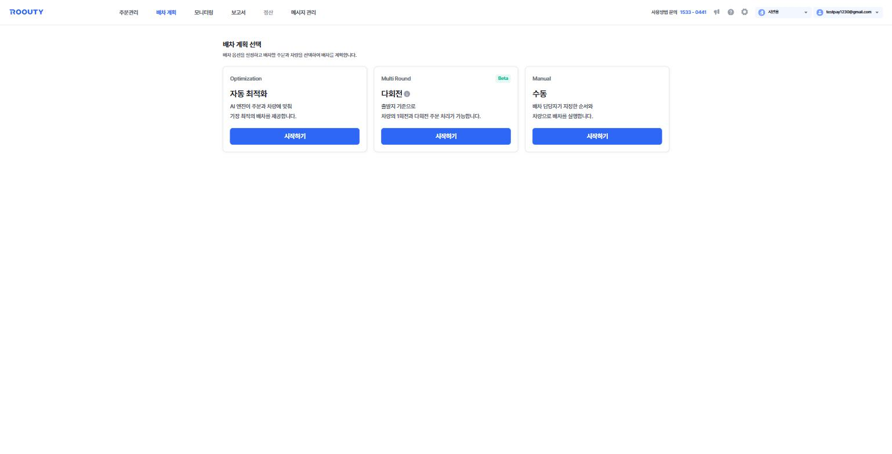
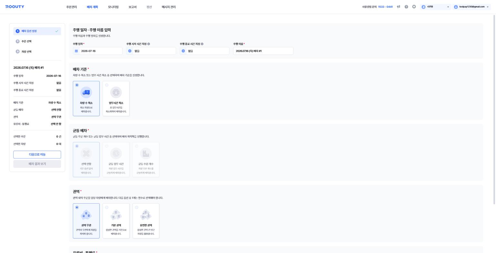
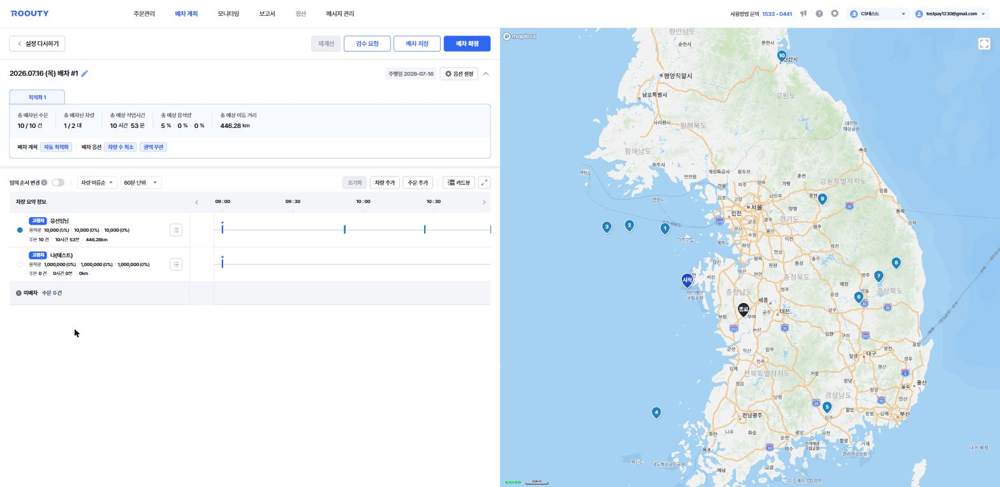

# 배차 계획

**등록된 주문을 어떤 차량이 어떤 순서로 처리할지 계획하는 메뉴**입니다. 배차 방식 선택 → 옵션 설정 → 주문 선택 → 차량 선택의 순서로 진행합니다.

*배차 계획 선택 화면 — 자동 최적화 · 다회전 · 수동 중 하나를 선택해 시작합니다.*

> 기준 화면: `tms.roouty.io/manage/route/*`

## 배차 계획 유형

| 구분 | 용어 | English | 정의 |
|---|---|---|---|
| 옵션 | 자동 최적화 | Optimization | AI 엔진이 주문과 차량에 맞춰 가장 최적의 배차를 제공 |
| 옵션 | 다회전 | Multi Round (Beta) | 출발지 기준으로 차량의 1회전·다회전 주문 처리 💬 다회전 배차에서는 일부 기능을 사용할 수 없습니다 |
| 옵션 | 수동 | Manual | 배차 담당자가 지정한 순서와 차량으로 배차를 실행 |
| 버튼 | 시작하기 | Start | 선택한 배차 방식으로 배차 계획 시작 |

## 배차 진행 단계

| 구분 | 용어 | English | 정의 |
|---|---|---|---|
| 단계 | 배차 옵션 설정 | Dispatch Options | 1단계 — 주행 정보와 배차 기준을 설정 |
| 단계 | 주문 선택 | Order Selection | 2단계 — 배차할 주문을 체크하여 선택 |
| 단계 | 차량 선택 | Vehicle Selection | 3단계 — 배차할 차량을 체크하여 선택 |
| 버튼 | 다음으로 이동 / 이전으로 이동 | Next / Back | 단계 간 이동 |
| 버튼 | 배차 결과 보기 | View Dispatch Result | 최적화 실행 후 배차 결과 화면으로 이동 |
| 표시 | 선택한 주문 / 선택한 차량 | Selected Orders / Vehicles | 현재 계획에 포함된 주문 건수·차량 대수 (좌측 요약 패널) |

## 배차 옵션

*자동 최적화의 배차 옵션 설정 화면 — 좌측에 진행 단계와 설정 요약, 우측에 옵션 카드가 있습니다.*

| 구분 | 용어 | English | 정의 |
|---|---|---|---|
| 필드 | 주행 일자 | Route Date | 주행이 이루어지는 날짜 (필수) |
| 필드 | 주행 이름 | Route Name | 배차 건의 이름 — 기본값 예: 2026.07.16 (목) 배차 #1 (필수) |
| 필드 | 주행 시작 시간 지정 | Route Start Time | 💬 설정한 시간에 맞추어 차량이 주행을 시작합니다. 차량의 개별 주행 시작 시간과 휴게 시간은 무시합니다. '없음'인 경우 차량의 개별 주행 시작 시간과 휴게 시간에 맞추어 배차됩니다 |
| 필드 | 주행 종료 시간 지정 | Route End Time | 💬 설정한 시간에 맞추어 차량이 주행을 종료합니다. 차량의 모든 작업을 끝낸 시간이 주행 종료 시간이 됩니다 |
| 옵션 | 배차 기준 | Dispatch Criteria | 차량 수 최소 / 업무시간 최소 중 선택 (필수) |
| 옵션 | └ 차량 수 최소 | Minimize Vehicles | 최소 차량으로 배차 |
| 옵션 | └ 업무시간 최소 | Minimize Work Time | 총 업무시간을 최소화하여 배차 |
| 옵션 | 균등 배차 | Balanced Dispatch | 선택 안함 / 균등 업무 시간 / 균등 주문 개수 (자동 최적화만) |
| 옵션 | └ 균등 업무 시간 | Balanced Work Time | 차량 업무 시간을 균등하게 배차 |
| 옵션 | └ 균등 주문 개수 | Balanced Order Count | 차량 주문 개수를 균등하게 배차 |
| 옵션 | 권역 | Zone | 권역 무관 / 기본 권역 / 유연한 권역 중 1개 필수 선택 |
| 옵션 | └ 권역 무관 | Zone-agnostic | 권역과 무관하게 차량을 최적화 |
| 옵션 | └ 기본 권역 | Fixed Zone | 설정한 권역을 기준으로 배차 |
| 옵션 | └ 유연한 권역 | Flexible Zone | 설정한 권역 간 인근 차량을 활용 |
| 옵션 | 유류비 · 통행료 | Fuel & Toll Cost | 이동 거리 기반 예상 유류비·통행료 계산 (선택 안 함 / 자동 계산) |

## 차량 선택 (3단계) 필터 · 컬럼

| 구분 | 용어 | English | 정의 |
|---|---|---|---|
| 필터 | 주행 상태 | Route Status | 임시저장 / 주행대기 / 주행중 / 주행종료 / 미배정 |
| 필터 | 운영 유형 | Operation Type | 고정차 / 지입차 / 고정용차 / 용차 |
| 컬럼 | 주문 대기 건수 | Pending Orders | 해당 차량에 배정되어 대기 중인 주문 수 |
| 컬럼 | 주문 종료 건수 | Completed Orders | 해당 차량이 처리 완료한 주문 수 |
| 컬럼 | 담당 권역 | Assigned Zone | 차량이 담당하는 권역 |
| 컬럼 | 출발지 주소 | Start Address | 차량이 주행을 시작하는 출발지 |

## 수동 배차

| 구분 | 용어 | English | 정의 |
|---|---|---|---|
| 필드 | 배차 설정 | Dispatch Settings | 주행 일자·주행 이름을 설정하는 좌측 패널 |
| 표시 | 수동 배차 요약 | Manual Dispatch Summary | 선택된 주문 수·차량 수 요약 |
| 버튼 | 주문 엑셀 업로드 | Order Excel Upload | 엑셀 양식으로 배차할 주문을 업로드 |
| 버튼 | 배차 계획 저장 | Save Dispatch Plan | 작성한 배차 계획을 저장 ⚠️ 저장하지 않고 나가면 배차결과가 삭제됩니다 |

## 배차 결과 화면

3단계까지 마치고 **배차 결과 보기**를 누르면 AI 최적화가 실행되고, 완료 후 아래 결과 화면이 열립니다. 여기서 결과를 검토·조정한 뒤 저장 또는 확정합니다.

*배차 결과 화면(타임뷰) — 상단 요약 지표, 좌측 차량별 타임라인, 우측 지도에 방문 순서와 경로가 표시됩니다.*

### 최적화 진행

| 구분 | 용어 | English | 정의 |
|---|---|---|---|
| 표시 | AI 최적화 중입니다 | Optimizing | 최적화 엔진 실행 중 안내. 배차 결과의 도착지 수만큼 라우팅 수가 차감됨 |
| 표시 | 배차 설정 | Dispatch Settings Summary | 실행 중 표시되는 설정 요약 (주행 이름·시작/종료 시간·주문·차량·기준/균등/권역/비용 옵션) |
| 버튼 | 배차 계획 취소 | Cancel Optimization | 실행 중인 최적화를 중단 |

### 상단 액션 버튼

| 구분 | 용어 | English | 정의 |
|---|---|---|---|
| 버튼 | 설정 다시하기 | Back to Settings | 배차 설정으로 되돌아감 ⚠️ 돌아가면 배차결과가 삭제됨 |
| 버튼 | 재계산 | Recalculate | 조정한 내용으로 경로를 다시 계산 |
| 버튼 | 검수 요청 | Request Review | 배차 결과에 대한 검수를 요청 (모니터링의 '검수 상태'와 연결) |
| 버튼 | 배차 저장 | Save Dispatch | 결과를 저장 — 모니터링 > 저장된 배차에서 수정·확정 가능 |
| 버튼 | 배차 확정 | Confirm Dispatch | 배차를 확정하여 주행대기 상태로 전환 (기사에게 경로 확정 안내 발송 조건) |
| 버튼 | 옵션 설정 | Option Settings | 적용된 배차 옵션을 확인·변경 |
| 탭 | 최적화 1 | Optimization 1 | 최적화 실행 결과 탭 (재계산 시 결과가 추가될 수 있음) |

### 결과 요약 지표

| 구분 | 용어 | English | 정의 |
|---|---|---|---|
| 표시 | 총 배차된 주문 | Total Assigned Orders | 선택 주문 대비 배차된 주문 수 (예: 10 / 10 건) |
| 표시 | 총 배차된 차량 | Total Assigned Vehicles | 선택 차량 대비 실제 배차된 차량 수 (예: 1 / 2 대) |
| 표시 | 총 예상 작업시간 | Total Estimated Work Time | 전체 배차의 예상 소요 시간 |
| 표시 | 총 예상 용적량 | Total Estimated Volume | 차량 용적량 대비 적재율(%) — 용적량1~3 기준별 표시 |
| 표시 | 총 예상 이동 거리 | Total Estimated Distance | 전체 차량의 예상 이동 거리 합계 (km) |
| 표시 | 배차 계획 / 배차 옵션 | Plan / Option Badges | 적용된 배차 방식(자동 최적화 등)과 옵션(차량 수 최소·권역 무관 등) 배지 |

### 결과 조정 도구

| 구분 | 용어 | English | 정의 |
|---|---|---|---|
| 옵션 | 임의 순서 변경 | Manual Reorder Mode | 토글 On 시 주문 순서를 사용자가 직접 변경 💬 자동 최적화 모드는 루티의 최적화 엔진으로 배차 결과를 제공합니다. 임의 순서 변경 모드는 주문 순서를 사용자가 임의로 변경 가능하며, 자동 최적화 결과를 제공하지 않습니다 |
| 버튼 | 초기화 | Reset | 조정 내용을 최적화 결과로 되돌림 |
| 버튼 | 차량 추가 | Add Vehicle | 결과에 차량을 추가 투입 |
| 버튼 | 주문 추가 | Add Order | 결과에 주문을 추가 |
| 버튼 | 카드뷰 / 타임뷰 | Card View / Time View | 차량별 비교 카드 화면과 타임라인 화면 간 전환 |
| 옵션 | 차량 이름순 | Sort by Vehicle Name | 차량 목록 정렬 기준 |
| 옵션 | 60분 단위 | Timeline Scale | 타임라인 시간축 눈금 단위 |

### 차량 요약 정보 (타임뷰)

| 구분 | 용어 | English | 정의 |
|---|---|---|---|
| 표시 | 차량 요약 정보 | Vehicle Summary | 차량별 용적량(적재율%) · 주문 건수 · 업무 시간 · 이동 거리 요약 |
| 표시 | 타임라인 | Timeline | 시간축 위에 차량별 방문 일정을 표시 (막대 = 작업, 마커 = 방문지) |
| 표시 | 미배차 | Unassigned | 이번 결과에서 어느 차량에도 배정되지 못한 주문 수 |
| 표시 | 시작 / 종료 | Start / End Marker | 지도상 차량 출발지·도착지 마커. 숫자 마커는 방문 순서 |
