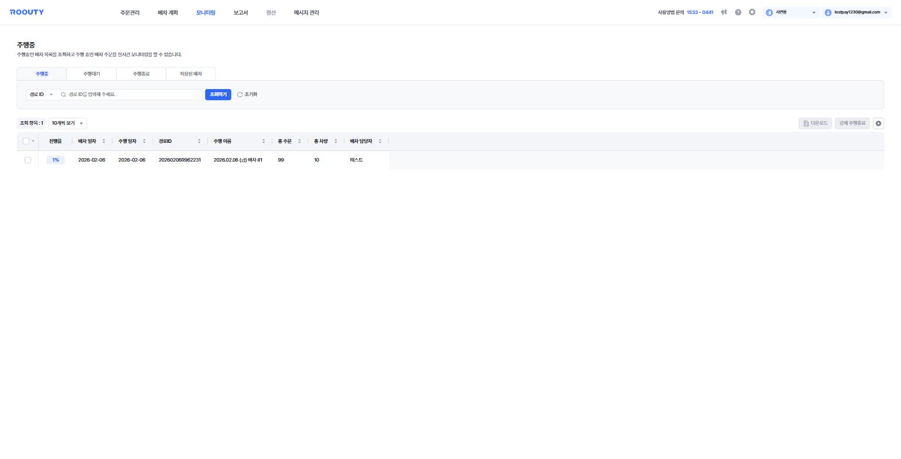
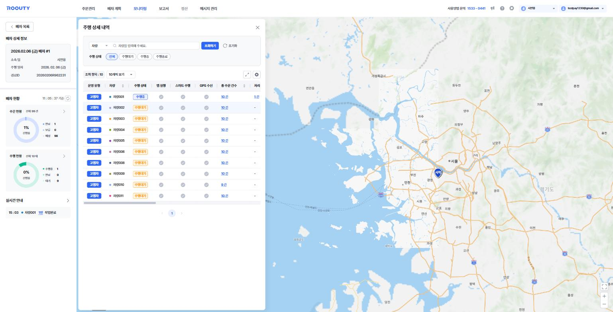
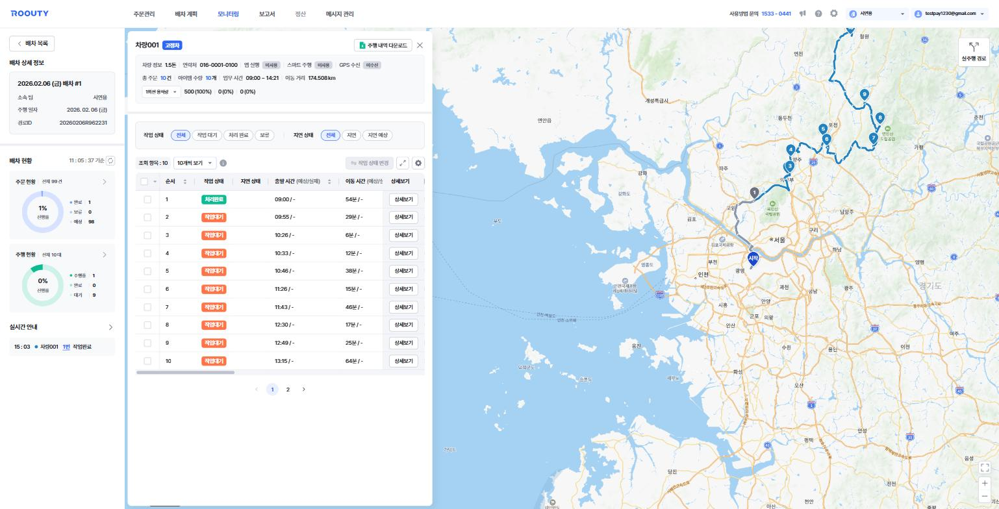

# 모니터링

**배차된 주행을 실시간으로 관제하는 메뉴**입니다. 배차 목록에서 특정 배차를 클릭하면 지도와 함께 차량별 진행 상황을 볼 수 있습니다.

*모니터링 첫 화면 — 주행 상태 탭(주행중/주행대기/주행종료/저장된 배차)과 배차 목록*

> 기준 화면: `tms.roouty.io/manage/control/*`

## 주행 상태 탭

| 구분 | 용어 | English | 정의 |
|---|---|---|---|
| 탭 | 주행중 | In Progress | 주행 중인 배차 조회 및 실시간 모니터링 |
| 탭 | 주행대기 | Waiting | 주행 대기 중인 배차 조회, 배차 취소 가능 |
| 탭 | 주행종료 | Completed | 주행이 끝난 배차 목록과 주행 히스토리 조회 |
| 탭 | 저장된 배차 | Saved Dispatch | 임시 저장된 배차 조회, 수정·확정 가능 |

## 배차 목록 컬럼 · 버튼

| 구분 | 용어 | English | 정의 |
|---|---|---|---|
| 컬럼 | 진행률 | Progress Rate | 배차 건의 주문 처리 진행 비율 |
| 컬럼 | 검수 상태 | Review Status | 배차 검수 진행 상태 |
| 컬럼 | 배차 일자 | Dispatch Date | 배차가 생성된 날짜 |
| 컬럼 | 주행 일자 | Route Date | 주행이 이루어지는 날짜 |
| 컬럼 | 경로ID | Route ID | 배차 건 고유 식별자 |
| 컬럼 | 주행 이름 | Route Name | 배차 건의 이름 |
| 컬럼 | 총 주문 / 총 차량 | Total Orders / Vehicles | 배차에 포함된 주문 건수·차량 대수 |
| 컬럼 | 보류 주문 | On-hold Orders | 주행종료 기준 보류 처리된 주문 수 |
| 컬럼 | 배차 담당자 | Dispatch Manager | 배차를 실행한 담당자 |
| 버튼 | 강제 주행종료 | Force End Route | 주행 중인 배차를 관리자가 강제로 종료 |
| 버튼 | 배차 취소 | Cancel Dispatch | 주행대기 상태의 배차를 취소 |
| 버튼 | 배차 계획 취소 | Cancel Dispatch Plan | 저장된 배차를 취소 |
| 버튼 | 배차 확정 | Confirm Dispatch | 저장된 배차를 확정하여 주행대기로 전환 |

## 배차 상세 화면

배차 목록에서 배차 건을 클릭하면 열립니다.

*배차 상세 — 좌측 배차 현황 요약, 가운데 주행 상세 내역(차량 목록), 우측 지도*

| 구분 | 용어 | English | 정의 |
|---|---|---|---|
| 표시 | 배차 상세 정보 | Dispatch Details | 소속 팀 · 주행 일자 · 경로ID 요약 |
| 표시 | 배차 현황 | Dispatch Status | 기준 시각의 주문·주행 현황 요약 |
| 표시 | 주문 현황 | Order Status | 전체 주문 대비 완료 / 보류 / 예정 건수와 진행률 |
| 표시 | 주행 현황 | Vehicle Status | 전체 차량 대비 주행중 / 완료 / 대기 대수와 진행률 |
| 표시 | 실시간 안내 | Live Feed | 차량의 작업완료 등 실시간 이벤트 알림 |
| 버튼 | 배차 목록 | Back to List | 배차 목록으로 돌아가기 |

### 주행 상세 내역 (차량 목록) 컬럼

| 구분 | 용어 | English | 정의 |
|---|---|---|---|
| 컬럼 | 앱 실행 | App Running | 기사 앱 실행 여부 (사용/미사용) |
| 컬럼 | 스마트 주행 | Smart Driving | 기사 앱 스마트 주행 기능 사용 여부 |
| 컬럼 | GPS 수신 | GPS Reception | 차량 GPS 수신 여부 (수신/미수신) |
| 컬럼 | 총 주문 건수 | Total Orders | 차량에 배정된 주문 수 |
| 컬럼 | 처리 완료 건수 | Completed Count | 처리 완료된 주문 수 |
| 컬럼 | 작업 대기 건수 | Pending Count | 작업 대기 중인 주문 수 |
| 컬럼 | 지연 건수 | Delayed Count | 지연된 주문 수 |
| 컬럼 | 지연 예상 건수 | Expected Delay Count | 지연이 예상되는 주문 수 |
| 컬럼 | 보류 건수 | On-hold Count | 보류된 주문 수 |
| 컬럼 | 업무 시간 | Work Hours | 차량의 주행 시작~종료 시간 |
| 컬럼 | 이동 거리 | Travel Distance | 차량의 총 이동 거리 (km) |

## 차량 상세 (주행 경로)

차량 목록에서 차량을 클릭하면 해당 차량의 방문지 목록과 경로가 표시됩니다.

*차량 상세 — 상단 차량 정보 요약, 방문 순서별 작업 목록, 지도의 번호 마커(방문 순서)와 실주행 경로*

| 구분 | 용어 | English | 정의 |
|---|---|---|---|
| 버튼 | 주행 내역 다운로드 | Download Route History | 해당 차량의 주행 내역을 파일로 다운로드 |
| 표시 | 차량 정보 | Vehicle Info | 차종·연락처 등 차량 기본 정보 |
| 표시 | 1회전 용적량 | Round 1 Capacity | 해당 회전에 적재된 용적량과 적재율(%) |
| 필터 | 작업 상태 | Task Status | 전체 / 작업 대기 / 처리 완료 / 보류 |
| 필터 | 지연 상태 | Delay Status | 전체 / 지연 / 지연 예상 |
| 버튼 | 작업 상태 변경 | Change Task Status | 선택한 주문의 작업 상태를 수동 변경 |
| 컬럼 | 순서 | Sequence | 차량이 주문을 처리하는 방문 순서 (지도 마커 번호와 일치) |
| 컬럼 | 출발/이동/도착 시간 (예상/실제) | Departure/Travel/Arrival Time | 방문지별 시간 — 최적화 예상값과 실제값을 함께 표시 |
| 컬럼 | 유휴 시간 (예상) | Idle Time (Est.) | 대기 등으로 발생하는 비작업 시간 |
| 컬럼 | 작업 소요 시간 (예상/실제) | Work Duration | 방문지에서의 작업 소요 시간 |
| 컬럼 | 완료 시간 (예상/실제) | Completion Time | 작업 완료 시간 |
| 컬럼 | 이동 거리 (예상/실제) | Distance | 구간별 이동 거리 |
| 버튼 | 상세보기 | View Details | 해당 주문의 상세 정보 열람 |
| 표시 | 실주행 경로 | Actual Route | 지도에 표시되는 실제 주행 경로 (우측 상단 토글) |
| 표시 | 시작 | Start (Depot) | 지도상 차량 출발지 마커 |
