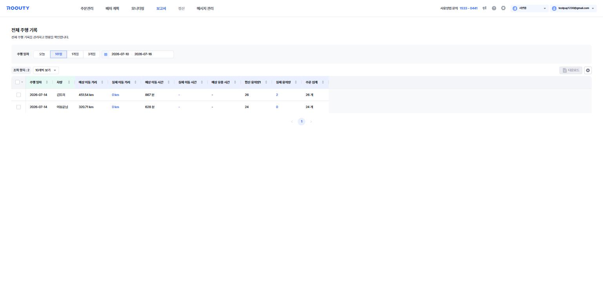

# 보고서

**완료된 주행의 실적 데이터를 집계·조회하는 메뉴**입니다. 예상값(최적화 계산)과 실제값(실주행)을 비교할 수 있습니다.

*보고서 > 전체 주행 기록 — 주행 일자 기준으로 이동 거리·시간·용적량·주문 수를 집계합니다.*

> 기준 화면: `tms.roouty.io/manage/report/route`, `/manage/report/route/driver`

## 하위 메뉴

| 구분 | 용어 | English | 정의 |
|---|---|---|---|
| 메뉴 | 전체 주행 기록 | All Route Records | 주행 일자 기준 전체 주행 기록 조회 |
| 메뉴 | 차량별 주행 기록 | Route Records by Vehicle | 차량 단위로 집계된 주행 기록 조회 |

## 측정 기준 (표의 행 기준)

표 항목 조회 설정(⚙️)의 **측정 기준** 탭에서 노출 여부를 관리합니다.

| 구분 | 용어 | English | 정의 |
|---|---|---|---|
| 컬럼 | 주행 일자 | Route Date | 주행이 이루어진 날짜 |
| 컬럼 | 차량 | Vehicle | 주행을 수행한 차량 |
| 컬럼 | 경로ID | Route ID | 배차 건 고유 식별자 |
| 컬럼 | 주행 이름 | Route Name | 배차 건의 이름 |
| 컬럼 | 소속 팀 | Team | 차량이 속한 팀 |

## 측정 항목 (지표)

표 항목 조회 설정(⚙️)의 **측정 항목** 탭에서 노출 여부를 관리합니다.

| 구분 | 용어 | English | 정의 |
|---|---|---|---|
| 컬럼 | 예상 이동 거리 / 실제 이동 거리 | Est./Actual Distance | 최적화 엔진 계산값과 실주행 이동 거리 |
| 컬럼 | 예상 이동 시간 / 실제 이동 시간 | Est./Actual Travel Time | 계산된 이동 시간과 실제 이동 시간 (분) |
| 컬럼 | 예상 유휴 시간 | Estimated Idle Time | 예상되는 비작업 대기 시간 |
| 컬럼 | 예상/실제 작업 소요 시간 | Est./Actual Work Duration | 방문지 작업 소요 시간 합계 |
| 컬럼 | 합산 용적량1~3 | Total Volume 1–3 | 주행에 포함된 주문의 용적량 합계 |
| 컬럼 | 실제 용적량 | Actual Volume | 실제 처리된 용적량 |
| 컬럼 | 주문 집계 | Order Count | 주행에 포함된 주문 수 |
| 컬럼 | 완료 주문 집계 / 보류 주문 집계 | Completed/On-hold Order Count | 처리 완료·보류된 주문 수 |
| 컬럼 | 아이템 수 | Item Count | 주행에 포함된 아이템 수량 합계 |

## 차량별 주행 기록 추가 컬럼

| 구분 | 용어 | English | 정의 |
|---|---|---|---|
| 컬럼 | 상태 | Status | 차량 활성 상태 (활성/비활성) |
| 컬럼 | 운영 유형 | Operation Type | 고정차 / 지입차 / 고정용차 / 용차 |
| 컬럼 | 용적량1 | Capacity 1 | 차량의 최대 용적량 (기준 1) |
