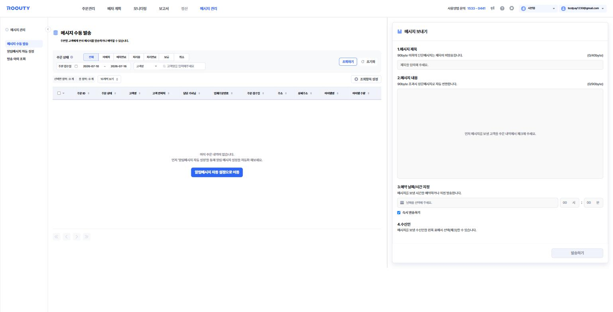

# 메시지 관리

**고객·기사·거래처에게 문자 메시지를 보내는 메뉴**입니다. 직접 발송(수동)과 주문 상태 변화에 따른 자동 발송을 모두 지원합니다.

*메시지 수동 발송 — 좌측에서 주문·수신인을 검색해 체크하고, 우측에서 메시지를 작성해 발송합니다.*

> 기준 화면: `tms.roouty.io/manage/message/*`

## 하위 메뉴

| 구분 | 용어 | English | 정의 |
|---|---|---|---|
| 메뉴 | 메시지 수동 발송 | Manual Message Send | 주문별 고객에게 문자를 직접 발송하거나 예약 |
| 메뉴 | 알림메시지 자동 설정 | Auto Notification Settings | 주문 상태·수신인 종류별 자동 발송 메시지를 설정 |
| 메뉴 | 발송 이력 조회 | Send History | 발송/예약한 메시지 내역 확인 |

## 메시지 수동 발송

| 구분 | 용어 | English | 정의 |
|---|---|---|---|
| 필터 | 주문 상태 | Order Status Filter | 전체 / 미배차 / 배차완료 / 처리중 / 처리완료 / 보류 / 취소 |
| 컬럼 | 담당 기사님 | Assigned Driver | 주문을 담당하는 기사 |
| 필드 | 메시지 제목 | Message Title | 40byte 이내 💬 90byte 이하 단문메시지는 제목이 미발송됩니다 |
| 필드 | 메시지 내용 | Message Body | 💬 90byte 초과 시 장문메시지로 자동 변환합니다 |
| 개념 | 단문메시지 / 장문메시지 | SMS / LMS | 90byte 기준으로 구분되는 문자 유형 |
| 필드 | 예약 날짜/시간 지정 | Scheduled Send | 메시지를 보낼 시간을 예약 |
| 옵션 | 즉시 발송하기 | Send Immediately | 예약 없이 바로 발송 (체크박스) |
| 필드 | 수신인 | Recipient | 메시지를 받을 대상 — 왼쪽 주문 목록에서 체크하여 선택 |
| 버튼 | 발송하기 | Send | 메시지 발송 실행 |
| 버튼 | 조회항목 설정 | Column Settings | 주문 목록에 표시할 컬럼 관리 |

## 알림메시지 자동 설정

주문 진행 단계에 따라 자동으로 발송되는 메시지를 관리합니다.

| 구분 | 용어 | English | 정의 |
|---|---|---|---|
| 필터 | 수신인 종류 | Recipient Type | 고객 / 기사 / 중개사 / 화주사 |
| 컬럼 | 활성 상태 | Active Status | 해당 알림메시지의 사용 여부 (토글) |
| 컬럼 | 진행 구분 | Stage | 준비중 / 진행중 / 완료 / 보고 — 알림이 발송되는 주문 진행 단계 |
| 컬럼 | 발송 시간 | Send Timing | 알림메시지가 발송되는 조건·시점 |
| 표시 | 발송 내용 | Message Content | 선택한 알림메시지의 상세 내용 (우측 패널) |

### 자동 알림메시지 종류

| 용어 | 수신인 | 발송 조건 |
|---|---|---|
| 서비스 일정 확정 안내 | 고객·중개사 | 배차 확정 시. 주행일 전일 16시 이전 확정 건은 16시에 일괄 발송, 이후·당일 건은 즉시 발송 |
| 경로 확정 안내 | 기사 | 배차 확정 시 기사에게 발송 |
| 서비스 예정 안내 | 고객·중개사 | 기사가 기사 앱에서 "주행 시작하기"를 누른 경우 |
| 서비스 완료 예정 안내 | 고객·중개사 | 기사가 해당 주문을 "시작하기"한 경우 |
| 서비스 완료 안내 | 고객·중개사 | 기사가 주문을 완료한 경우 |
| 배차 업무 완료 보고 | 화주사 | 배차 업무의 완료·보류 건이 100%가 된 경우 |

## 발송 이력 조회

| 구분 | 용어 | English | 정의 |
|---|---|---|---|
| 탭 | 자동 발송 | Auto Sent | 알림메시지 자동 설정으로 발송된 내역 |
| 탭 | 수동(예약) 발송 | Manual (Scheduled) Sent | 수동·예약 발송 내역 |
| 탭 | 발송 제외 | Excluded | 발송에서 제외된 내역 |
| 컬럼 | 발송(예정)일/시간 | Send (Scheduled) Time | 발송되었거나 발송 예정인 일시 |
| 컬럼 | 수신인 명 | Recipient Name | 메시지를 받은 대상의 이름 |
