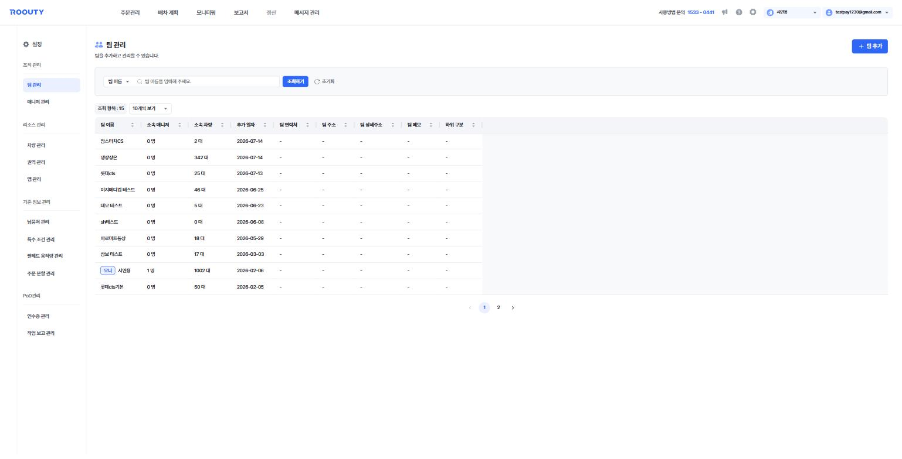
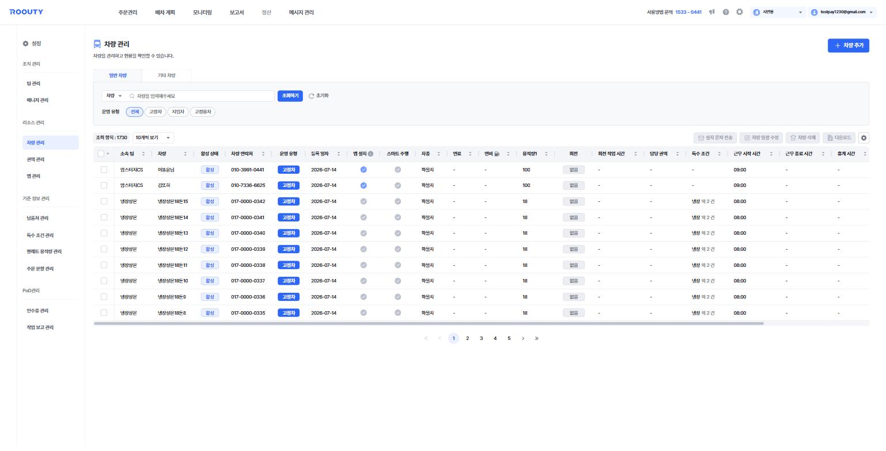

# 설정

**팀·차량·권역 등 배차의 기반이 되는 정보를 관리하는 메뉴**입니다. 상단 GNB의 톱니바퀴(⚙️) 아이콘으로 진입합니다.
신규 도입 시에는 보통 팀 → 매니저 → 차량 → 권역 → 특수 조건 순으로 세팅합니다.

*설정 첫 화면(팀 관리) — 좌측에 설정 하위 메뉴가 분류별로 정리되어 있습니다.*

> 기준 화면: `tms.roouty.io/setting`

## 설정 메뉴 구조

| 분류 | 하위 메뉴 |
|---|---|
| 조직 관리 | 팀 관리 · 매니저 관리 |
| 리소스 관리 | 차량 관리 · 권역 관리 · 앱 관리 |
| 기준 정보 관리 | 납품처 관리 · 특수 조건 관리 · 팔레트 용적량 관리 · 주문 분할 관리 |
| PoD관리 | 인수증 관리 · 작업 보고 관리 |

## 팀 관리

| 구분 | 용어 | English | 정의 |
|---|---|---|---|
| 개념 | 팀 | Team | 차량·매니저·주문을 묶는 조직 단위 |
| 버튼 | 팀 추가 | Add Team | 신규 팀 등록 |
| 컬럼 | 소속 매니저 / 소속 차량 | Team Managers / Vehicles | 팀에 속한 매니저 수·차량 대수 |
| 컬럼 | 추가 일자 | Created Date | 팀 등록 일자 |
| 컬럼 | 팀 연락처 / 팀 주소 / 팀 상세주소 / 팀 메모 | Team Contact / Address / Detail / Memo | 팀 기본 정보 |
| 컬럼 | 하위 구분 | Sub-category | 팀에 연결된 하위 구분 값 |

## 매니저 관리

| 구분 | 용어 | English | 정의 |
|---|---|---|---|
| 개념 | 매니저 | Manager | TMS를 사용하는 관리자 계정 |
| 버튼 | 매니저 초대 | Invite Manager | 이메일로 매니저를 초대 |
| 탭 | 소속 매니저 / 초대한 매니저 | Joined / Invited Managers | 가입 완료된 매니저와 초대 대기 중인 매니저 |
| 버튼 | 소속 팀 변경 | Change Team | 매니저의 소속 팀 변경 |
| 버튼 | 매니저 삭제 | Delete Manager | 매니저 계정 삭제 |
| 컬럼 | 아이디(이메일) | ID (Email) | 매니저 로그인 계정 |
| 컬럼 | 소속 일자 | Joined Date | 매니저가 팀에 소속된 날짜 |

## 차량 관리

*차량 관리 — 차량별 활성 상태, 운영 유형, 용적량, 특수 조건, 근무 시간 등을 관리합니다.*

| 구분 | 용어 | English | 정의 |
|---|---|---|---|
| 탭 | 일반 차량 / 기타 차량 | Regular / Other Vehicles | 차량 목록 탭 구분 |
| 버튼 | 차량 추가 | Add Vehicle | 신규 차량 등록 — 직접 입력 또는 [차량추가 양식](../forms/vehicle-add-form.md)(엑셀) 업로드 |
| 버튼 | 설치 문자 전송 | Send Install SMS | 기사 앱 설치 안내 문자를 차량(기사)에게 발송 |
| 버튼 | 차량 일괄 수정 | Bulk Edit Vehicles | 선택한 여러 차량 정보를 한 번에 수정 |
| 버튼 | 차량 삭제 | Delete Vehicle | 선택한 차량 삭제 |
| 컬럼 | 활성 상태 | Active Status | 차량 사용 여부 (활성/비활성) |
| 컬럼 | 차량 연락처 | Vehicle Contact | 기사 휴대폰 번호 (기사 앱 계정) |
| 컬럼 | 운영 유형 | Operation Type | 고정차 / 지입차 / 고정용차 / 용차 |
| 개념 | └ 고정차 | Fixed Vehicle | 당사가 직접 운영하는 차량 |
| 개념 | └ 지입차 | Owner-operated Vehicle | 지입 계약으로 운영되는 차량 |
| 개념 | └ 고정용차 | Fixed Chartered Vehicle | 고정 계약된 용차 |
| 개념 | └ 용차 | Chartered Vehicle | 필요 시 일시 계약하는 외부 차량 |
| 컬럼 | 등록 일자 | Registered Date | 차량 등록 일자 |
| 컬럼 | 앱 설치 | App Installed | 기사 앱 설치 여부 |
| 컬럼 | 스마트 주행 | Smart Driving | 기사 앱 스마트 주행 기능 사용 여부 |
| 컬럼 | 차종 | Vehicle Model | 차량 종류 — 배차 시 차종에 따른 최적 경로 생성 |
| 컬럼 | 연료 / 연비 | Fuel Type / Efficiency | 유류비 계산에 사용 (경유/휘발유/LPG 등) |
| 컬럼 | 용적량1~3 | Capacity 1–3 | 차량에 적재 가능한 최대 용적량 |
| 컬럼 | 회전 / 회전 작업 시간 | Rounds / Round Work Time | 회전 수(1~5)와 회전 간 작업 시간(10~180분) |
| 컬럼 | 담당 권역 | Assigned Zone | 차량이 담당하는 권역 |
| 컬럼 | 근무 시작/종료 시간 | Work Start / End Time | 차량의 주행 가능 시간대 |
| 컬럼 | 휴게 시간 | Break Time | 차량의 휴게시간 (분) |
| 컬럼 | 출발지/도착지 주소 | Start / End Address | 주행 출발지와 복귀 도착지 |

## 권역 관리

| 구분 | 용어 | English | 정의 |
|---|---|---|---|
| 표시 | 권역 등록·관리 | Zone Management | 배차에 적용할 권역을 등록하고 차량을 지정 |
| 표시 | 권역 목록 | Zone List | 등록된 권역 목록 |
| 버튼 | 권역 추가 | Add Zone | 지도에서 지역을 선택해 권역 생성 |
| 필드 | 지역 검색 | Region Search | 시/도 · 시/군/구 · 읍/면/동 단위 검색 |

## 앱 관리

팀별로 기사 앱의 동작 방식을 제어합니다.

| 구분 | 용어 | English | 정의 |
|---|---|---|---|
| 옵션 | 자동 출발 처리 | Auto Departure | 출발을 자동으로 처리 |
| 옵션 | 자동 도착 처리 | Auto Arrival | 도착을 자동으로 처리 |
| 옵션 | 자동 주행 시작 / 종료 | Auto Route Start / End | 주행 시작·종료를 자동 처리 |
| 옵션 | 주문 임의 순서 변경 | Reorder Orders | 기사가 주문 처리 순서를 임의로 변경 가능 여부 |
| 옵션 | 차량 주문 검수 | Vehicle Order Review | 기사 앱에서 주문 검수 기능 사용 여부 |

## 납품처 관리

| 구분 | 용어 | English | 정의 |
|---|---|---|---|
| 버튼 | 납품처 추가 / 납품처 삭제 | Add / Delete Delivery Point | 고정 배송지 등록·삭제 |
| 필터 | 업체 유형 | Business Type | 할인점 / 할인점 물류센터 / SSM / CVS / 대리점 / 온라인 / 직거래 / 기타 |
| 버튼 | 좌표 변경 | Adjust Coordinates | 주소 좌표를 지도에서 직접 수정 |
| 컬럼 | 좌표 변경 여부 | Coordinate Adjusted | 좌표 수정 여부 (변경/미변경) |
| 컬럼 | 담당 차량 지정 | Assigned Vehicle | 해당 납품처를 처리할 차량 지정 |
| 컬럼 | 제외 차량 지정 | Excluded Vehicle | 해당 납품처 배차에서 제외할 차량 지정 |

## 특수 조건 관리

| 구분 | 용어 | English | 정의 |
|---|---|---|---|
| 버튼 | 조건 추가 / 조건 삭제 | Add / Delete Condition | 특수 조건 등록·삭제 |
| 컬럼 | 조건 이름 / 조건 설명 | Condition Name / Description | 조건의 명칭과 설명 (예: 냉장, 18톤) |
| 컬럼 | 소속 차량 | Assigned Vehicles | 해당 조건이 부여된 차량 |

## 팔레트 용적량 관리

| 구분 | 용어 | English | 정의 |
|---|---|---|---|
| 개념 | 팔레트 용적량 | Pallet Volume | 업체 유형에 따라 배차 시 자동 합산되는 팔레트 단위 용적량 |
| 버튼 | 용적량 추가 / 용적량 삭제 | Add / Delete Volume Setting | 팔레트 용적량 설정 등록·삭제 |
| 컬럼 | 설정명 | Setting Name | 팔레트 용적량 설정의 이름 |
| 컬럼 | 팔레트 용적량 사용 | Use Pallet Volume | 해당 설정의 사용 여부 |

## 주문 분할 관리

| 구분 | 용어 | English | 정의 |
|---|---|---|---|
| 개념 | 주문 분할 | Order Splitting | 조건에 따라 주문을 나누어 처리하는 기능 |
| 버튼 | 분할 조건 추가 / 삭제 | Add / Delete Split Condition | 분할 조건 등록·삭제 |
| 컬럼 | 주문 분할 사용 여부 | Split Enabled | 팀별 주문 분할 기능 사용 여부 |

## 인수증 관리

| 구분 | 용어 | English | 정의 |
|---|---|---|---|
| 개념 | 인수증 | Receipt (PoD) | 배송 완료 증빙 문서 |
| 옵션 | 활성화 | Enable | 인수증 기능 사용 여부 (토글) |
| 버튼 | 정보 추가하기 | Add Info | 인수증에 사용되는 화주사 주소·업체 정보 등록 |
| 버튼 | 정보 삭제 | Delete Info | 등록된 업체 정보 삭제 |

## 작업 보고 관리

| 구분 | 용어 | English | 정의 |
|---|---|---|---|
| 개념 | 작업 보고 | Work Report | 작업 후 기사가 제출하는 보고 |
| 버튼 | 수량 변경 사유 설정 | Quantity Change Reasons | 수량 변경 시 선택할 사유 항목 설정 |
| 컬럼 | 작업 완료 보고(PoD) | Completion Report (PoD) | 팀별 작업 완료 보고 필수/선택 설정 |
| 컬럼 | 작업 완료 사진 | Completion Photo | 작업 완료 사진 제출 필수/선택 설정 |
